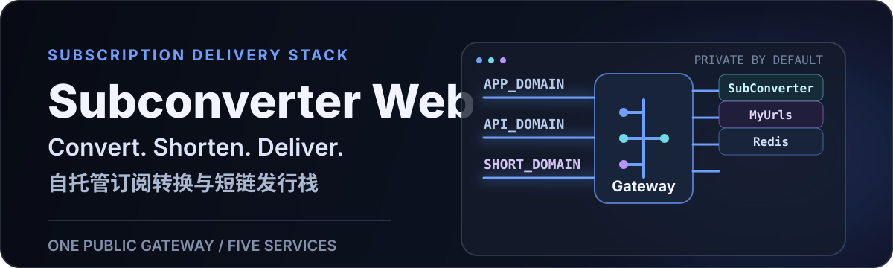
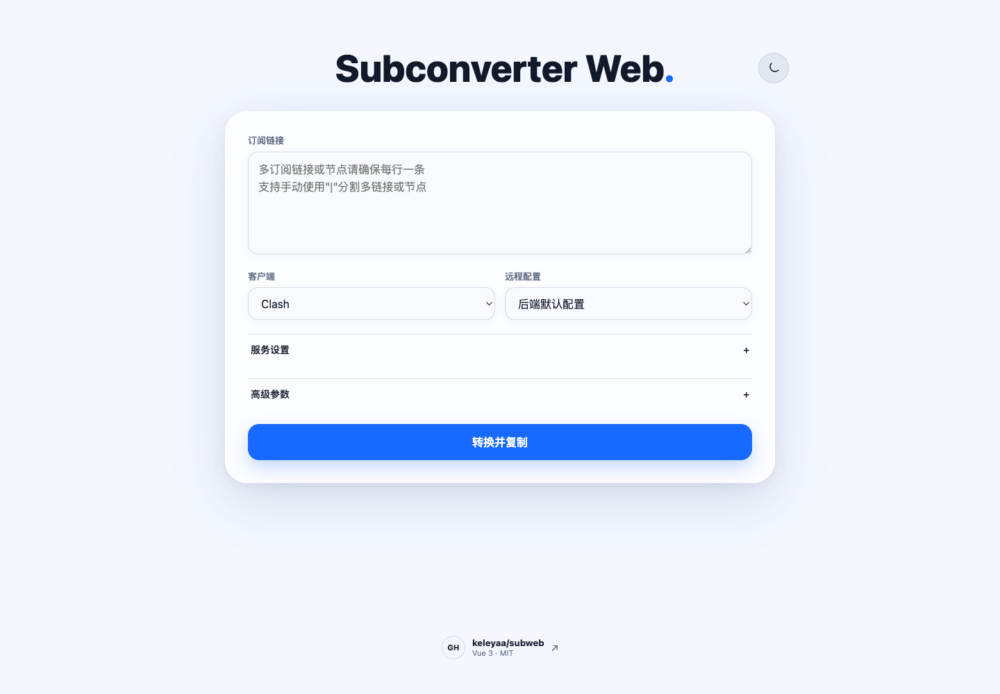
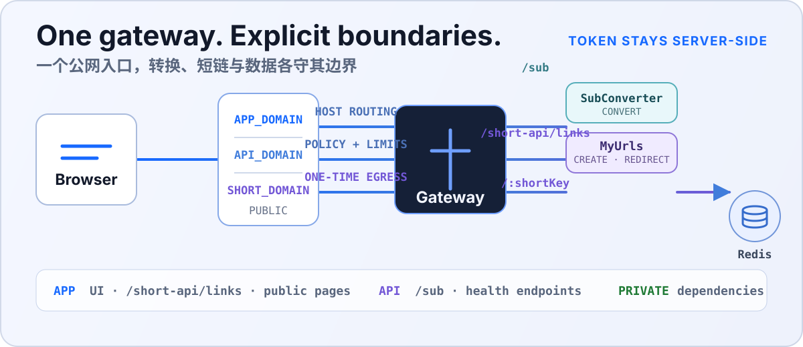

# Subconverter Web

**Self-hosted subscription delivery.**

**自托管订阅转换发行栈。**

<p align="center">
  
</p>

<p align="center">
  
</p>

Subconverter Web is the Subweb-integrated stack for subscription conversion, short links, Redis-backed persistence, and one controlled gateway. A browser reaches only the application and API domains; the conversion engine, short-link service, and Redis stay behind that boundary.

Subconverter Web 是 Subweb 的一体化自托管方案，将订阅转换、短链、Redis 持久化和统一网关放在同一套部署中。浏览器只访问应用域名和 API 域名；转换引擎、短链服务与 Redis 均保持在内部边界之后。

## What You Run / 运行内容

- **Two public domains.** `APP_DOMAIN` serves the web app, short-link creation proxy, and short-code redirects. `API_DOMAIN` serves `/sub` and other conversion routes.
- **两个公网域名。** `APP_DOMAIN` 提供网页、短链创建代理与短码跳转；`API_DOMAIN` 提供 `/sub` 等转换路由。
- **One controlled gateway.** It routes by host and injects the MyUrls token server-side, so the browser never receives that token.
- **一个受控网关。** 网关按 Host 路由，并在服务端注入 MyUrls Token，浏览器不会取得该 Token。
- **Internal services.** SubConverter-Extended performs conversion, MyUrls creates and resolves short links, and Redis is the only business persistence layer.
- **内部服务。** SubConverter-Extended 负责转换，MyUrls 创建和解析短链，Redis 是唯一业务持久层。
- **Controlled update policy.** The gateway, SubConverter-Extended, and Redis use recorded versions; MyUrls follows its published `latest` stable release by default. Preserve Redis data for recovery, and use an explicit MyUrls image override only for a controlled rollback.
- **受控更新策略。** Gateway、SubConverter-Extended 与 Redis 使用记录的版本；MyUrls 默认跟随其已发布的稳定 `latest`。恢复时重点保留 Redis 数据；需要受控回滚时再显式覆盖 MyUrls 镜像。

## Service Boundary / 服务边界

<p align="center">
  
</p>

The gateway is the public boundary. Conversion links are handled by SubConverter-Extended; short-link creation is sent to the same-origin `/short-api/short` route, where the gateway adds the server-side token before MyUrls writes the mapping to Redis. Resolving a short code returns a redirect from MyUrls.

网关是唯一公网边界。转换链接由 SubConverter-Extended 处理；创建短链时，浏览器请求同源 `/short-api/short`，网关在转交 MyUrls 前注入仅在服务端保存的 Token，并由 MyUrls 把映射写入 Redis。访问短码时，MyUrls 返回跳转。

## Deploy / 部署

### Docker

Use Docker Compose for a server deployment. The first command sequence clones the repository into a dedicated directory; run every later project command from that `subweb` directory.

服务器部署建议使用 Docker Compose。首次执行会将仓库克隆到独立目录；之后所有项目命令都必须在该 `subweb` 目录中运行。

```sh
mkdir -p "$HOME/apps"
cd "$HOME/apps"
git clone https://github.com/keleyaa/subweb.git
cd subweb
```

For an existing reverse proxy such as Nginx, OpenResty, Baota, 1Panel, or Cloudflare Tunnel, run the published-image deployment. Replace both example domains with domains you control.

已有 Nginx、OpenResty、宝塔、1Panel 或 Cloudflare Tunnel 等外层反向代理时，使用已发布镜像部署。请将两个示例域名替换为自己的域名。

```sh
./scripts/docker-deploy.sh --mode behind-proxy \
  --app-domain sub.example.com \
  --api-domain api.example.com
docker compose ps
```

The script creates the untracked `.env`, MyUrls token, and Redis password for you. Published gateway images are available from `docker.io/keleyaa/subweb` and `ghcr.io/keleyaa/subweb`. For a reproducible production rollout, pass an issued `sha-*` image tag with `--image`; do not guess tags from a local commit.

脚本会自动创建不提交的 `.env`、MyUrls Token 和 Redis 密码。网关镜像同时发布到 `docker.io/keleyaa/subweb` 与 `ghcr.io/keleyaa/subweb`。生产环境应通过 `--image` 指定已发行的 `sha-*` 镜像标签；不要根据本地提交猜测远端标签。

The maintainer's display deployment uses `ml1.one` and `api.ml1.one` as examples only. Replace both domains with names you control before deploying your own instance.

维护者展示部署使用 `ml1.one` 与 `api.ml1.one`，它们仅是示例。部署自己的实例前，请替换为你控制的两个域名。

When there is no outer proxy, `direct-tls` is available only when ports 80/443 are unused and you already have one certificate covering both domains. The project does not require Caddy and does not obtain or renew certificates. Full proxy, TLS, update, backup, and rollback instructions are in [Docker deployment](docs/deployment-docker.md).

没有外层代理时，只有在 80/443 未占用并且已拥有覆盖两个域名的证书时才可使用 `direct-tls`。本项目不依赖 Caddy，也不会申请或续期证书。完整的反向代理、TLS、升级、备份与回滚说明见 [Docker 部署](docs/deployment-docker.md)。

### Local Source Runtime / 本机源码运行

Use the source runtime for local development and verification. It builds the pinned MyUrls and SubConverter sources, then starts Redis, the two backend services, Vite, and two local gateway entries.

本机源码运行适合开发与验证。它会构建锁定的 MyUrls 和 SubConverter 源码，并启动 Redis、两个后端服务、Vite 与两个本机网关入口。

```sh
git clone https://github.com/keleyaa/subweb.git
cd subweb
./scripts/local/bootstrap.sh
./scripts/local/start.sh
./scripts/local/status.sh
```

Open `http://127.0.0.1:18080/` after startup, then stop the local stack with `./scripts/local/stop.sh`. This mode is loopback-only by default and is not the default public-production route.

启动后访问 `http://127.0.0.1:18080/`，结束时运行 `./scripts/local/stop.sh`。本模式默认只监听 loopback，不是默认的公网生产部署方式。

## Security Boundary / 安全边界

Subscription URLs can contain credentials. They are visible to SubConverter when converted, and a short link stores the complete conversion URL in Redis. A short code is not encryption; anyone who receives it can normally follow its redirect.

订阅链接可能携带凭据。转换时 SubConverter 会看到它，而短链会把完整转换链接保存到 Redis。短码不是加密；获得短码的人通常可以跟随跳转。

Keep `.env`, `.runtime/`, certificates, Redis backups, platform variables, and historical diagnostic logs out of Git and public issue reports. Subweb sanitizes new SubConverter logs, but old containers, backups, and external log platforms may still retain raw requests. The browser configuration contains only public URLs and presets; the MyUrls token and Redis password stay server-side.

请勿将 `.env`、`.runtime/`、证书、Redis 备份、平台变量或历史诊断日志提交到 Git 或公开问题报告。Subweb 会脱敏新的 SubConverter 日志，但旧容器、备份和外部日志平台仍可能保留原始请求。浏览器配置只包含公开 URL 与预设；MyUrls Token 与 Redis 密码仅保留在服务端。

Read [Security boundary](docs/security.md) before exposing the stack publicly.

在公网部署前，请阅读[安全边界](docs/security.md)。

## Source Lineage / Fork 与来源说明

This repository, [`keleyaa/subweb`](https://github.com/keleyaa/subweb), began as a fork of [`stilleshan/subweb`](https://github.com/stilleshan/subweb) and is now independently maintained for this integrated stack. The short-link service is the maintainer fork [`keleyaa/MyUrls`](https://github.com/keleyaa/MyUrls), whose upstream is [`CareyWang/MyUrls`](https://github.com/CareyWang/MyUrls). Conversion uses the official, actively maintained [`Aethersailor/SubConverter-Extended`](https://github.com/Aethersailor/SubConverter-Extended) project without carrying its source in this repository.

本仓库 [`keleyaa/subweb`](https://github.com/keleyaa/subweb) fork 自 [`stilleshan/subweb`](https://github.com/stilleshan/subweb)，现作为这套一体化栈独立维护。短链服务使用维护者 fork 的 [`keleyaa/MyUrls`](https://github.com/keleyaa/MyUrls)，其上游为 [`CareyWang/MyUrls`](https://github.com/CareyWang/MyUrls)；转换服务直接使用持续维护的官方 [`Aethersailor/SubConverter-Extended`](https://github.com/Aethersailor/SubConverter-Extended)，不在本仓库携带其源码。

The interface is an independent adaptation guided by Apple platform material, hierarchy, and accessibility principles and the restrained MyUrls page; it does not copy third-party code, DOM, CSS, images, icons, or trademarks.

界面以 Apple 平台的材质、层级和可访问性原则，以及 MyUrls 页面克制的产品气质为方法参考；没有复制第三方代码、DOM、CSS、图片、图标或商标。

Pinned versions, image digests, licenses, modification boundaries, and the MyUrls `latest` policy are recorded in [third-party sources](docs/third-party-sources.md).

锁定版本、镜像摘要、许可证、修改边界及 MyUrls `latest` 策略见[第三方来源](docs/third-party-sources.md)。

## Documentation / 文档

- [Architecture / 架构说明](docs/architecture.md)
- [Runtime configuration / 运行时配置](docs/configuration.md)
- [Deployment index / 部署索引](docs/deployment.md)
- [Local source runtime / 本机源码运行](docs/deployment-local.md)
- [Docker deployment / Docker 部署](docs/deployment-docker.md)
- [Security boundary / 安全边界](docs/security.md)
- [Operations / 运维手册](docs/operations.md)
- [Third-party sources / 第三方来源](docs/third-party-sources.md)
- [Interface design / 界面设计规范](docs/interface-design.md)
- [Remote configuration sources / 远程配置来源](docs/remote-config-sources.md)
- [Maintenance and releases / 维护与发布](docs/maintenance.md)

## License / 许可证

The repository code is licensed under [GPL-3.0](LICENSE). Integrated components and remote configuration sources keep their own licenses.

本仓库代码采用 [GPL-3.0](LICENSE)；集成组件与远程配置来源继续遵循各自许可证。
