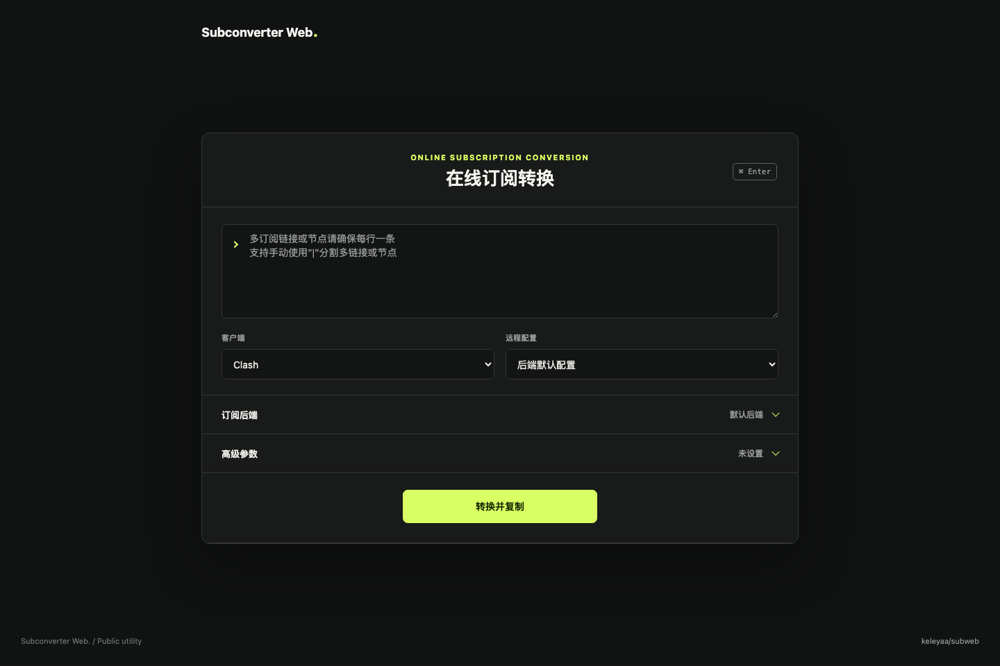
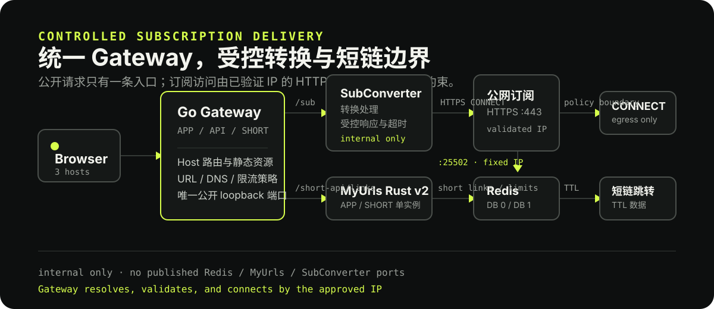

# Subconverter Web

> 面向自托管维护者的在线订阅转换与短链服务。统一 Go Gateway、受控 HTTPS CONNECT egress，以及可审计的五服务 Docker 部署。

[](https://github.com/keleyaa/subweb/actions/workflows/docker-build-release.yml) [](https://github.com/keleyaa/subweb/actions/workflows/local-dev.yml)

<p align="center">
  
</p>

## 能力

- **订阅转换：** 输入订阅链接或节点，选择客户端与远程配置后生成可复制的转换地址。
- **统一 Gateway：** Go 1.25 单二进制负责 APP、API、SHORT Host 路由、静态资源、请求策略、限流、MyUrls 适配和内部 CONNECT egress。
- **短链：** 通过同源 `/short-api/links` 创建短链；APP 创建与 SHORT 解析使用独立的 MyUrls Rust v2 实例。
- **可控功能开关：** `SHORT_LINKS_ENABLED` 控制是否部署 MyUrls/Redis，`CUSTOM_BACKEND_ENABLED` 控制前端自定义后端；安全策略不可关闭。
- **PWA 图标：** 提供 favicon、Apple Touch Icon、`192 px` / `512 px` 图标与 manifest。

## 快速开始

### 环境要求

本机源码开发使用 Docker Compose 与 Vite；生产部署使用 Docker Compose，不需要在容器中运行 Node.js。

- Docker Engine 与 Docker Compose v2
- OpenSSL、curl
- Node.js 24 与 npm 11（源码开发、验证和发布门禁）
- 启用短链时使用 3 个不同域名：APP、API、SHORT；关闭短链时不需要 SHORT 域名

### 生产 Docker 部署

```sh
git clone https://github.com/keleyaa/subweb.git
cd subweb
./scripts/subweb.sh install \
  --app-domain app.example.com \
  --api-domain api.example.com \
  --short-domain short.example.com \
  --turnstile-site-key YOUR_SITE_KEY \
  --image ghcr.io/keleyaa/subweb:sha-<commit>
```

命令会在终端隐藏提示输入 Turnstile Secret Key，随后自动校验、拉取镜像并启动服务；CI 或非交互环境再使用 `--turnstile-secret-key-stdin`。

默认启用短链时会运行 `gateway`、`subconverter`、`myurls-app`、`myurls-short` 和 `redis` 五个服务。所有 APP、API、SHORT 域名由外层 TLS 反向代理转发到 `127.0.0.1:<SUBWEB_PORT>`，并保留原始 Host。项目自身不管理 HTTPS 证书、80/443 端口或公网 DNS。

关闭短链时将 `SHORT_LINKS_ENABLED=false` 写入配置，部署入口会选择 `compose.disabled-short-links.yaml`，只运行 Gateway 与 SubConverter，不需要 `SHORT_DOMAIN`、Redis、MyUrls 或 Turnstile 私钥。完整步骤见 [部署索引](docs/deployment.md) 和 [Docker 部署](docs/deployment-docker.md)。

### 预构建镜像

Docker Hub 的 `docker.io/keleyaa/subweb` 与 GHCR 的 `ghcr.io/keleyaa/subweb` 是等价的 Gateway 发布来源。使用 [`scripts/docker-deploy.sh`](scripts/docker-deploy.sh) 时必须显式传入 `--image`，并只接受 `sha-*` 标签或 `@sha256` 摘要，拒绝可变的 `latest`。SubConverter、MyUrls Rust 和 Redis 的版本与 digest 由 [版本锁](deploy/versions.lock.json) 管理。

## 架构

<p align="center">
  
</p>

生产短链 profile 的五个服务和网络边界见 [架构](docs/architecture.md)。短链关闭时使用显式两服务 profile。外部 TLS 入口属于部署者，不是 Compose 服务。

| 服务           | 职责                                                                                    |
| -------------- | --------------------------------------------------------------------------------------- |
| `gateway`      | 唯一公开 loopback 端口；统一 Host 路由、静态资源、策略、限流、短链适配和 CONNECT egress |
| `subconverter` | 订阅转换执行器，只能通过内部 egress 网络访问                                            |
| `myurls-app`   | MyUrls Rust v2.0.6 的 APP 域名短链创建和管理 API                                        |
| `myurls-short` | SHORT 域名的短码跳转                                                                    |
| `redis`        | DB `0` 保存短链，DB `1` 保存 Gateway HMAC IP 限流状态                                   |

## 界面操作

1. 粘贴订阅链接或节点。
2. 选择客户端与远程配置。
3. 按需展开「订阅后端」或「高级参数」；两项不会同时占用页面空间。
4. 点击「转换并复制」。成功后显示转换结果和短链操作。

页面固定使用黑色命令主题，不提供明暗主题切换。交互目标、键盘焦点、减少动效与增强对比度均有独立验证。

## 安全与隐私

- Gateway 只发布 loopback 端口；MyUrls、Redis 和 SubConverter 不发布宿主机端口。
- `/sub` 强制执行 DNS、SSRF、响应大小、超时、并发、限流和 `:443` CONNECT 策略；SubConverter 不能绕过 Gateway 直接访问公网。
- Gateway 清理凭据、Cookie、Origin、客户端转发头和敏感请求信息；日志不记录原始 IP、订阅 URL、Query、Token、Redis 密码或完整短码。
- 转换 URL 与结果不写入 Redis；用户主动创建的短链按 TTL 保存，短链属于持有即可访问的数据。
- `proxy-providers` URL 由最终客户端直接拉取，不经过本服务 egress；这是客户端侧边界。

详细边界见 [安全](docs/security.md) 与 [配置](docs/configuration.md)。

## 验证与维护

```sh
npm ci
npm run verify:ci
npm run verify:release
git diff --check
```

`npm run verify:ci` 是 GitHub quality job 与本地发布验证共用的 Docker 门禁。`npm run verify:integration` 执行真实 unified business smoke，`npm run verify:operations` 执行 Redis backup/restore 恢复演练。真实部署仍必须通过 `scripts/configure.sh` 生成权限为 `0600` 的 `.env`。

发布前、备份恢复、镜像锁定与推送边界见 [维护与发布](docs/maintenance.md)。

## 文档

**使用与配置**

- [架构](docs/architecture.md)
- [配置](docs/configuration.md)
- [远程配置来源](docs/remote-config-sources.md)
- [界面设计](docs/interface-design.md)

**部署与安全**

- [部署总览](docs/deployment.md)
- [本地开发](docs/deployment-local.md)
- [Docker 部署](docs/deployment-docker.md)
- [外部 TLS 反向代理示例](docs/deployment-nginx.md)
- [安全边界](docs/security.md)
- [运维](docs/operations.md)

**验证、来源与维护**

- [单一 HTTP Docker 集成验证](docs/validation/docker-integration.md)
- [Compose-first 本地验证](docs/validation/local-dev.md)
- [Command Interface 界面验证](docs/validation/interface.md)
- [SubConverter 容器契约](deploy/subconverter/README.md)
- [第三方来源](docs/third-party-sources.md)
- [维护与验证](docs/maintenance.md)

## Fork 与来源说明

本项目是对 [stilleshan/subweb](https://github.com/stilleshan/subweb) 的独立维护版本，保留订阅转换的前端基础，并以自托管 Go Gateway、受控请求策略、短链与部署验证作为当前运行边界。MyUrls 来自 [keleyaa/MyUrls](https://github.com/keleyaa/MyUrls) 与 [CareyWang/MyUrls](https://github.com/CareyWang/MyUrls)，转换引擎来自 [Aethersailor/SubConverter-Extended](https://github.com/Aethersailor/SubConverter-Extended)。

完整的镜像来源、版本与许可证说明见 [第三方来源](docs/third-party-sources.md)。

需要只运行一个容器时，可使用 [单容器 Docker 部署](docs/deployment-docker.md#单容器模式)。该模式将所有组件放入同一个容器，保留 Redis 数据卷，但组件级隔离能力较弱。
